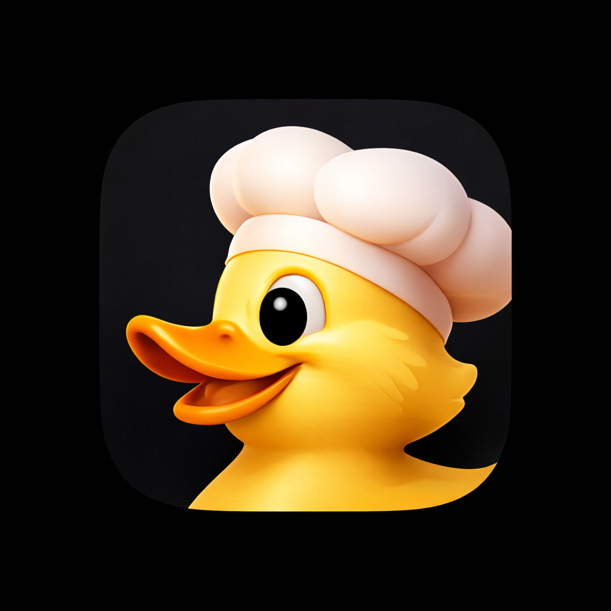

<p align="center">
  
</p>

<h1 align="center">DuckBake</h1>

<p align="center">
  A desktop app for local data analysis powered by DuckDB and AI.<br>
  Query your data with SQL or natural language—everything stays on your Mac.
</p>

<p align="center">
  <a href="https://github.com/wes/duckbake/releases/latest">Download for macOS</a>
</p>

<p align="center">
  
</p>

## Features

- **DuckDB-Powered Analytics** - Lightning-fast analytical queries on local data. Handle millions of rows with ease.
- **AI Chat Interface** - Ask questions in plain English and get SQL queries generated instantly via Ollama.
- **100% Private** - Your data never leaves your device. No cloud, no accounts, no data collection.
- **Import Anything** - CSV, JSON, Excel, and Parquet files. Drag and drop to create queryable tables.
- **SQL Editor** - Full-featured editor with syntax highlighting for writing and running queries.
- **Native macOS App** - Built with Tauri for a small footprint and native performance.

## Screenshots

<p align="center">
  
  <br><em>SQL Editor with syntax highlighting and autocomplete</em>
</p>

<p align="center">
  
  <br><em>Chat with your data using natural language</em>
</p>

## Requirements

- macOS 13.0 or later
- [Ollama](https://ollama.ai) (optional, for AI features)

## Installation

[Download the latest release](https://github.com/wes/duckbake/releases/latest/download/DuckBake-macOS.dmg) or browse all releases on the [Releases page](https://github.com/wes/duckbake/releases).

The DMG includes a universal binary that runs natively on both Intel and Apple Silicon Macs.

## Development

### Prerequisites

- [Bun](https://bun.sh) (latest)
- [Rust](https://rustup.rs) (stable)
- Xcode Command Line Tools

### Setup

```bash
# Clone the repository
git clone https://github.com/wes/duckbake.git
cd duckbake

# Install dependencies
bun install

# Run in development mode
bun tauri dev
```

### Build

```bash
# Build for current architecture
bun run release

# Build universal macOS binary (Intel + Apple Silicon)
bun run release:mac
```

## Tech Stack

**Frontend**
- React 19
- TypeScript
- Tailwind CSS 4
- Vite
- CodeMirror (SQL editor)
- Recharts (visualizations)
- Zustand (state management)

**Backend**
- Rust
- Tauri 2
- DuckDB
- Tokio (async runtime)

**AI**
- Ollama (local LLM inference)

## Project Structure

```
duckbake/
├── src/                  # React frontend
│   ├── components/       # UI components
│   ├── pages/            # App pages
│   ├── stores/           # Zustand stores
│   └── types/            # TypeScript types
├── src-tauri/            # Rust backend
│   └── src/
│       ├── commands/     # Tauri commands
│       ├── models/       # Data models
│       └── services/     # Business logic
└── website/              # Marketing website
```

## Contributing

Contributions are welcome! Please feel free to submit a Pull Request.

## License

MIT
